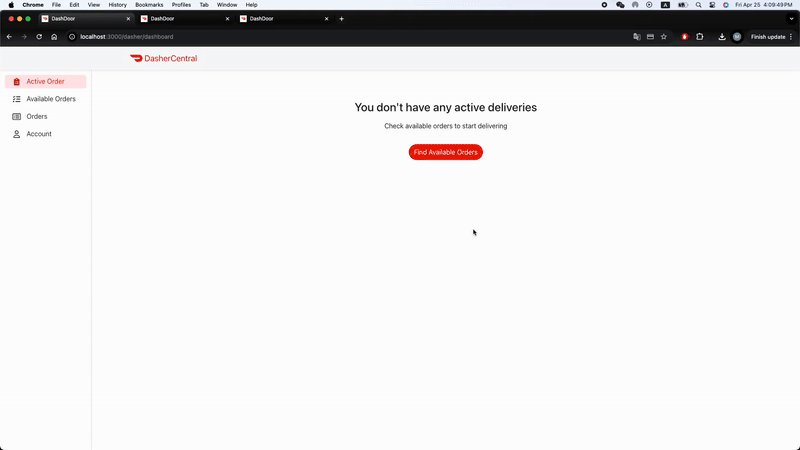

# Food Delivery Application

A full-stack food delivery platform connecting customers, restaurants, and delivery drivers (dashers).

## Overview

This project is a comprehensive food delivery application built with React and TypeScript. The application serves three main user types:
- **Customers** can browse restaurants, place orders, and track deliveries
- **Restaurants** can manage their menus and handle incoming orders
- **Dashers** can accept delivery assignments and update order status

## Technologies Used

- **Frontend**:
  - React
  - TypeScript
  - Redux Toolkit & RTK Query
  - SCSS for styling
  
- **Backend**:
  - Connects to a REST API (at http://localhost:8080 by default)
  - Link to backend repo: https://github.com/XieWen2000/final_backend_5500

## Features Showcase

### Customer Experience
<div align="center">
  
</div>
*Customers can browse restaurants, place orders, and track deliveries*

### Restaurant Experience
<div align="center">
  
</div>
*Restaurants can accept orders, update order status, and create, upload, delete menu items*

### Dasher Experience 
<div align="center">
  
</div>
*Dashers can accept deliverys, update the status* 

## Getting Started

### Installation

1. Clone the repository
```bash
git clone <repository-url>
cd 5500-final-frontend
```

2. Install dependencies
```bash
npm install
```

3. (Optional) Create a .env file in the root directory with the following content:
`REACT_APP_BASE_API=<backend-url>`. default url is http://localhost:8080

4. Start the development server
```bash
npm start
``` 
or if you want to run with nodemon
```bash
npm run dev
``` 

The application will be available at http://localhost:3000

Building for Production
```bash
npm run build
```

